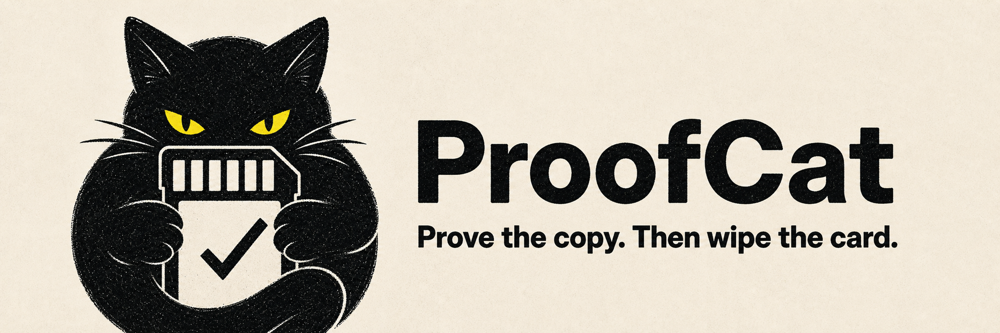
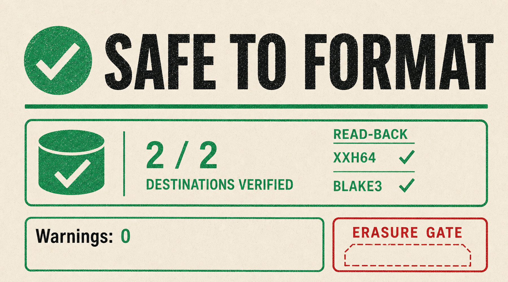

  <a href="README.md">English</a> · <a href="README.zh-CN.md">中文</a> · <a href="README.ru.md">Русский</a> · <a href="README.ja.md">日本語</a>

# ProofCat

  <picture>
    <source media="(prefers-color-scheme: dark)" srcset="docs/assets/hero-dark.png">
    
  </picture>

<strong>カードを再利用する前に、検証済みのコピーを二つ作成します。</strong>

  macOS と Windows 向けの、無料・オフラインのカメラカードオフロードツール。 
  <a href="https://github.com/reynikman/proofcat/releases/tag/v0.3.0"><strong>ProofCat 0.3.0 をダウンロード</strong></a>
  · <a href="docs/TECHNICAL.md">技術ドキュメント（英語）</a>

撮影が終わりました。ProofCat はカードを選択したドライブへコピーし、
それぞれを独立して確認して、明確な答えを返します。勝手にフォーマットすることはありません。
カードを再利用するのに十分な根拠があるかどうかだけを示します。

## 明確な一つの答え

1. カメラカードと二つの保存先ドライブを選びます。
2. ProofCat が必要なすべてのファイルをコピーして確認します。
3. **SAFE TO FORMAT** と表示されたときだけ、カードを再利用します。

ファイルの欠落、検証失敗、ジョブの中断、ディスク容量不足、設定の曖昧さがあれば、
この判定は表示されません。同じ物理ディスク上の二つのフォルダは、二つのバックアップではありません。

  <picture>
    <source media="(prefers-color-scheme: dark)" srcset="docs/assets/verdict-dark.png">
    
  </picture>

## 撮影後の大事な瞬間のために

- **標準でオフライン。** メディアは手元のマシンに残ります。
- **本当に別の二つの保存先。** フォルダ名ではなくデバイスを確認します。
- **推測ではなく再開。** ドライブをつなぎ直し、中断したジョブを続けられます。
- **渡せる証拠。** コピーについて読みやすいレポートを残せます。
- **オフロードだけではありません。** 同じアプリでメディア確認とメタデータ／納品レポートの出力もできます。

## ProofCat を入手する

**ProofCat 0.3.0** は **Apple Silicon Mac** と **Windows x64** に対応しています。
[リリースページ](https://github.com/reynikman/proofcat/releases/tag/v0.3.0)から必要なインストーラを入手してください。

初回起動時に macOS は Gatekeeper、Windows は SmartScreen の警告を表示することがあります。
現在のリリースは Apple notarization および Windows Authenticode 署名をまだ行っていません。
リリースページにはチェックサムと署名があります。確認方法は
[技術ドキュメント](docs/TECHNICAL.md#installation-and-release-integrity)を参照してください。

## 技術的な詳細が必要ですか？

簡潔な製品メッセージと技術的な根拠は意図的に分けています。以下の技術資料は英語です。

| 質問 | 読むもの |
|---|---|
| `SAFE TO FORMAT` は正確には何を意味する？ | [Safety contract](docs/offload-guarantees.md) |
| コピーと検証の仕組みは？ | [Technical documentation](docs/TECHNICAL.md) |
| 実機テストの結果は？ | [Hardware test report](docs/TEST_REPORT.md) |
| 境界とリスクは？ | [Threat model](docs/threat-model.md) |
| 既存ツールとの比較は？ | [Honest comparison](docs/COMPARISON.md) |
| ビルドまたは貢献するには？ | [Contributing](CONTRIBUTING.md) |

## オープンソース、そして判定への説明責任

ProofCat は [MIT ライセンス](LICENSE)です。撮影カードを再利用してよいかを判断する
ツールのソースは、検査できるべきです。問題を見つけた場合は
[GitHub issue](https://github.com/reynikman/proofcat/issues)を作成してください。
セキュリティ上の問題には[非公開の脆弱性報告](SECURITY.md)を使用してください。
