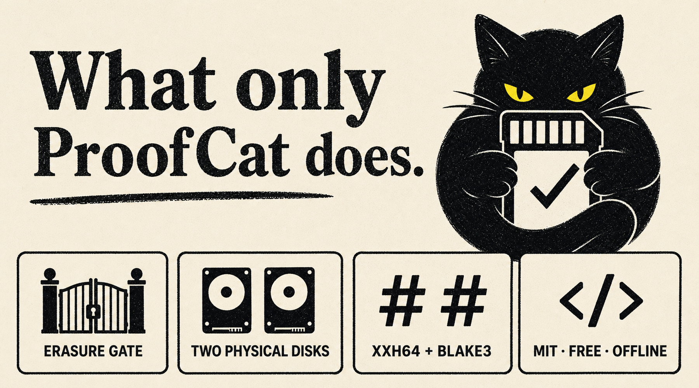

  <a href="README.md">English</a> · <a href="README.zh-CN.md">中文</a> · <a href="README.ru.md">Русский</a> · <a href="README.ja.md">日本語</a>

# ProofCat

  <picture>
    <source media="(prefers-color-scheme: dark)" srcset="docs/assets/hero-dark.png">
    
  </picture>

<strong>Make two verified copies before you reuse the card.</strong>

  Free, offline camera-card offload for macOS and Windows. 
  <a href="https://github.com/reynikman/proofcat/releases/tag/v0.3.0"><strong>Download ProofCat 0.3.0</strong></a>
  · <a href="docs/TECHNICAL.md">Technical documentation</a>

You finish a shoot. ProofCat copies the card to your chosen drives, checks those
copies independently, and gives a clear answer. It never formats anything for
you. It tells you when the evidence is strong enough to reuse the card — and
when it is not.

## One clear answer

1. Choose the camera card and two destination drives.
2. ProofCat copies and checks every required file.
3. Reuse the card only when the app says **SAFE TO FORMAT**.

Any missing file, failed check, interrupted job, full drive, or ambiguous setup
withholds that verdict. Two folders on the same physical disk do not count as
two backups.

  <picture>
    <source media="(prefers-color-scheme: dark)" srcset="docs/assets/verdict-dark.png">
    
  </picture>

## Made for the moment after the shoot

- **Offline by default.** Your media stays on the machine.
- **Two real destinations.** ProofCat checks devices, not just folder names.
- **Resume instead of guessing.** Reconnect a drive and continue a stopped job.
- **Evidence you can hand over.** Keep a readable report with the copies.
- **More than offload.** Inspect media and export metadata and delivery reports
  in the same app.

  <picture>
    <source media="(prefers-color-scheme: dark)" srcset="docs/assets/advantages-dark.png">
    
  </picture>

## Get ProofCat

**ProofCat 0.3.0** runs on **macOS Apple Silicon** and **Windows x64**. Download
the installer for your platform from the
[release page](https://github.com/reynikman/proofcat/releases/tag/v0.3.0).

macOS may show a Gatekeeper prompt and Windows may show a SmartScreen prompt on
first launch because the current release is not Apple-notarized or
Authenticode-signed. The release page includes checksums and signatures; the
[technical documentation](docs/TECHNICAL.md#installation-and-release-integrity)
explains how to verify them.

## Need the technical detail?

The product deliberately keeps its simple promise separate from the engineering
evidence behind it.

| Question | Read |
|---|---|
| What exactly does `SAFE TO FORMAT` mean? | [Safety contract](docs/offload-guarantees.md) |
| How does the copy and verification pipeline work? | [Technical documentation](docs/TECHNICAL.md) |
| What happened on real hardware? | [Hardware test report](docs/TEST_REPORT.md) |
| What are the limits and threat boundaries? | [Threat model](docs/threat-model.md) |
| How does ProofCat compare with established tools? | [Honest comparison](docs/COMPARISON.md) |
| How can I build or contribute? | [Contributing](CONTRIBUTING.md) |

## Open source, accountable by design

ProofCat is [MIT-licensed](LICENSE). The source is public because a tool that
tells you whether a shoot card may be reused should be inspectable. If you find
an issue, [open a GitHub issue](https://github.com/reynikman/proofcat/issues).
For a security issue, use [private vulnerability reporting](SECURITY.md).
